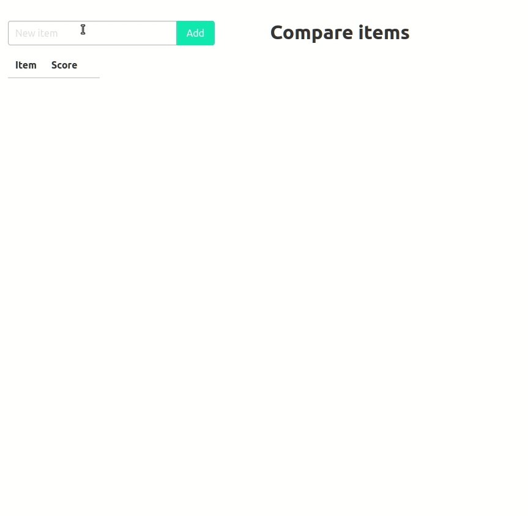

# Pairwise Comparison Method

Pairwise comparison (or paired comparison) is a process of comparing entities in pairs to judge which of each entity is preferred.

Sometimes it is hard to choose between multiple options.
Comparing each option with others in pairs simplifies the choice and helps to identify the most preferred option.

The pairwise comparison can be presented as a table.
Options are compared at the intersection of rows and columns.
If an option in a row is preferable to an option in a column, put **1** at the intersection and **0** otherwise.

Only comparisons of pairs above the diagonal line of the table are needed.
Values for pairs below the diagonal line can be calculated by simply inverting the corresponding values above the diagonal.

Finally, sum all the values in the row to get a score of the option.

Example 1:

|   | **A** | **B** | **C** | **D** | **Score** |
|---|---|---|---|---|---|
| **A** | - | 1 | 1 | 1 | **3** |
| **B** | 0 | - | 1 | 1 | **2** |
| **C** | 0 | 0 | - | 1 | **1** |
| **D** | 0 | 0 | 0 | - | **0** |

Example 2:

|   | **A** | **B** | **C** | **D** | **Score** |
|---|---|---|---|---|---|
| **A** | - | 1 | 1 | 0 | **2** |
| **B** | 0 | - | 0 | 1 | **1** |
| **C** | 0 | 1 | - | 1 | **2** |
| **D** | 1 | 0 | 0 | - | **1** |

## Pairwise comparison

The pairwise comparison method can be implemented as an interactive web application.

https://evgeniy-khist.github.io/pairwise-comparison/pairwise-comparison.html

## Image pairwise comparison

The pairwise comparison method can also be used for choosing the best image or photo.

https://evgeniy-khist.github.io/pairwise-comparison/image-pairwise-comparison.html

## Solution comparison

When it comes to important decisions, it's better not to compare solutions directly.
Instead, prepare a set of requirements that the solution should satisfy, 
prioritize the requirements using pairwise comparison method, 
and choose the solution that best meets the requirements.

https://evgeniy-khist.github.io/pairwise-comparison/solution-comparison.html

